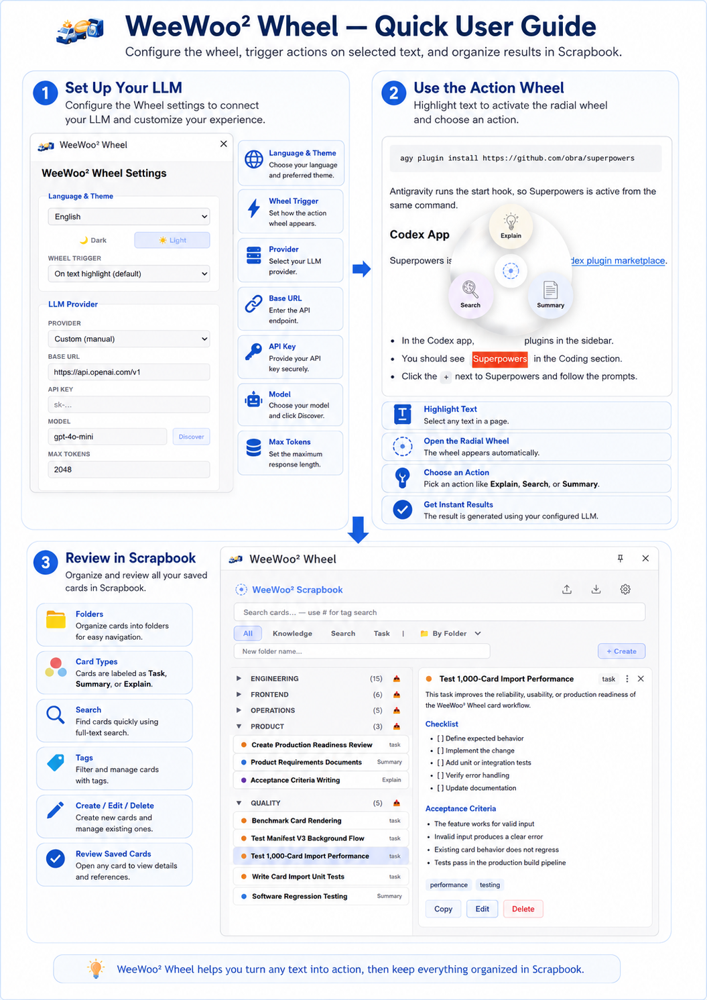

# WeeWoo² Wheel

<p align="center">
  
</p>

<p align="center">
  <strong>AI radial command wheel that turns selected web text into summaries, tasks, and knowledge cards — in one click.</strong>
</p>

<p align="center">
  <a href="#-screenshots">Screenshots</a> ·
  <a href="#-quick-start">Quick Start</a> ·
  <a href="#-typical-use">Typical Use</a> ·
  <a href="#-features">Features</a> ·
  <a href="#-docs">Docs</a>
</p>

---

## 📸 Screenshots

> **Chrome Web Store screenshots (1280×800) are being prepared for the v0.1.0 release.**
> See [pre-release tracker](docs/progress/pre-release-0.1.0.md) for status.

<p align="center">
  
</p>

## 🚀 Quick Start

```bash
git clone https://github.com/gcgloven/weewoo_wheel.git
cd weewooweeoo
pnpm install
pnpm dev          # Development build with HMR
pnpm build        # Production build → .output/chrome-mv3/
```

Load in Chrome: `chrome://extensions` → **Developer mode** → **Load unpacked** → select `weewooweeoo/.output/chrome-mv3-dev` (dev) or `weewooweeoo/.output/chrome-mv3` (prod).

> **Chrome Web Store listing in progress** — v0.1.0 pre-release preparations underway. [Track progress →](docs/progress/pre-release-0.1.0.md)

## 🧭 Typical Use

1. **Configure your provider** — Open the options page (right-click the extension icon → Options), enter your OpenAI-compatible API key, base URL, and model. Works with OpenAI, Ollama (local), Groq, OpenRouter, and more.
2. **Select text on any webpage** — Highlight a paragraph, sentence, or phrase.
3. **Pick an action from the radial wheel** — Explain, Summarize, Search, or Create Task.
4. **Review the result** — The result panel appears with an editable title and body. It auto-saves on success.
5. **Open the scrapbook** — Click the extension icon to open the side panel. Cards are grouped by date, searchable, filterable, and exportable.

**Trigger modes:** The wheel can appear automatically on text highlight, or only via right-click context menu — configurable in Options.

## 🏗️ Project Layout

```
weewooweeoo/     ← Extension source (WXT + React 18 + TypeScript)
docs/            ← Product spec, plans, progress, screenshots, privacy policy
.agents/skills/  ← Agent skills for extension development
```

## 🛠️ Tech Stack

| Layer | Technology |
|-------|-----------|
| Framework | [WXT](https://wxt.dev) + React 18 + TypeScript |
| Storage | IndexedDB via Dexie + chrome.storage.local |
| LLM | OpenAI-compatible adapter (BYO key) |
| Testing | Jest + jest-chrome + tsx/Puppeteer (E2E) |
| Package Manager | pnpm |

## 🔄 Architecture

```
Text selection → Radial wheel (shadow DOM) → Pick action
  → RUN_ACTION message to background worker
  → Background calls LLM (OpenAI-compatible adapter)
  → Result panel (editable title + body, auto-saved on success)
  → Auto-enrich (title + tags via LLM) → IndexedDB
  → Scrapbook side panel (grouped by date, searchable, filterable)
  → Options page (provider config, wheel slots, theme, language)
```

## ✨ Features

| Feature | Status |
|---------|--------|
| Radial wheel UI (shadow DOM isolated, game-like colored dial) | ✅ |
| Action registry (Explain, Summarize, Search, Task) | ✅ |
| Selection detection + wheel positioning | ✅ |
| Result panel (editable title/body, auto-save on success) | ✅ |
| OpenAI-compatible LLM adapter (BYO key) | ✅ |
| IndexedDB card storage (Dexie CRUD) | ✅ |
| Settings persistence (chrome.storage.local, cache invalidation) | ✅ |
| Per-action prompt builders + prompt bank | ✅ |
| Action dispatch (RUN_ACTION → LLM → ActionResult) | ✅ |
| Smart title extraction (per action type) | ✅ |
| Auto-enrichment (LLM title + tags before save) | ✅ |
| Agentic web search (DuckDuckGo + LLM synthesis) | ✅ |
| Scrapbook side panel (group by date, search, filter, copy, delete) | ✅ |
| Card import/export (JSON) | ✅ |
| Options page (provider, model, prompts, theme, language, wheel config) | ✅ |
| Light/dark theme + emoji/doodle wheel skins | ✅ |
| English & 中文 bilingual support | ✅ |
| Right-click context menu integration | ✅ |
| Shadow DOM event fix (real mouse clicks work) | ✅ |
| Pre-publish prep (icons, permission audit, CWS zip) | ✅ |
| CWS store listing copy + privacy policy | ✅ |
| CWS screenshots (1280×800) | 🔄 |

## 🧪 Test Suite

```bash
cd weewooweeoo
pnpm test:unit           # 64 tests across 13 suites
pnpm test:integration    # 3 tests across 1 suite
pnpm test                # All 67 tests
pnpm build && node --import tsx tests/e2e/configure-and-search.ts  # Full E2E flow
node --import tsx tests/e2e/store-screenshots.ts  # CWS screenshot capture
```

## 📚 Docs

| File | Purpose |
|------|---------|
| [docs/user_scenario_doc.md](docs/user_scenario_doc.md) | Product vision & user scenarios |
| [docs/plan/2026-07-09-weewoo-wheel-mvp.md](docs/plan/2026-07-09-weewoo-wheel-mvp.md) | Master implementation plan |
| [docs/product_benchmark.md](docs/product_benchmark.md) | Competitor analysis |
| [docs/progress/](docs/progress/) | Per-phase progress tracking (0–8 + pre-release) |
| [docs/pre-release_plan.md](docs/pre-release_plan.md) | Chrome Web Store release readiness plan |
| [docs/progress/pre-release-0.1.0.md](docs/progress/pre-release-0.1.0.md) | v0.1.0 pre-release progress tracker |
| [docs/privacy-policy.md](docs/privacy-policy.md) | Privacy policy |
| [docs/store-listing-copy.md](docs/store-listing-copy.md) | CWS listing copy |
| [docs/permission-justifications.md](docs/permission-justifications.md) | CWS permission justifications |
| [docs/repair/repair-log-ButtonNotResponsive.md](docs/repair/repair-log-ButtonNotResponsive.md) | Post-MVP bug fix log (6 bugs) |

## 📈 Progress

| Phase | Status | Notes |
|-------|--------|--------|
| 0 — Scaffold | ✅ | `7f8bf54` |
| 1 — Core Infrastructure | ✅ | `99d7356` |
| 2 — Radial Wheel | ✅ | `24754ea` |
| 3 — Result Panel | ✅ | `f4e8ae8` |
| 4 — Actions & Dispatch | ✅ | `880242f` |
| 5 — Scrapbook Side Panel | ✅ | `4131964` |
| 6 — Options Page | ✅ | `61713cc` |
| 7 — E2E Test Hardening | ✅ | `bab2754` |
| 8 — Pre-Publish Prep | ✅ | `674b82e` |
| 🚀 0.1.0 Pre-Release | 🔄 | Gates pass. Screenshots + manual QA remain. |
| 🔧 Post-MVP fixes | ✅ | `5bf2c7e`–`b36dd9d` |

## 📄 License

MIT